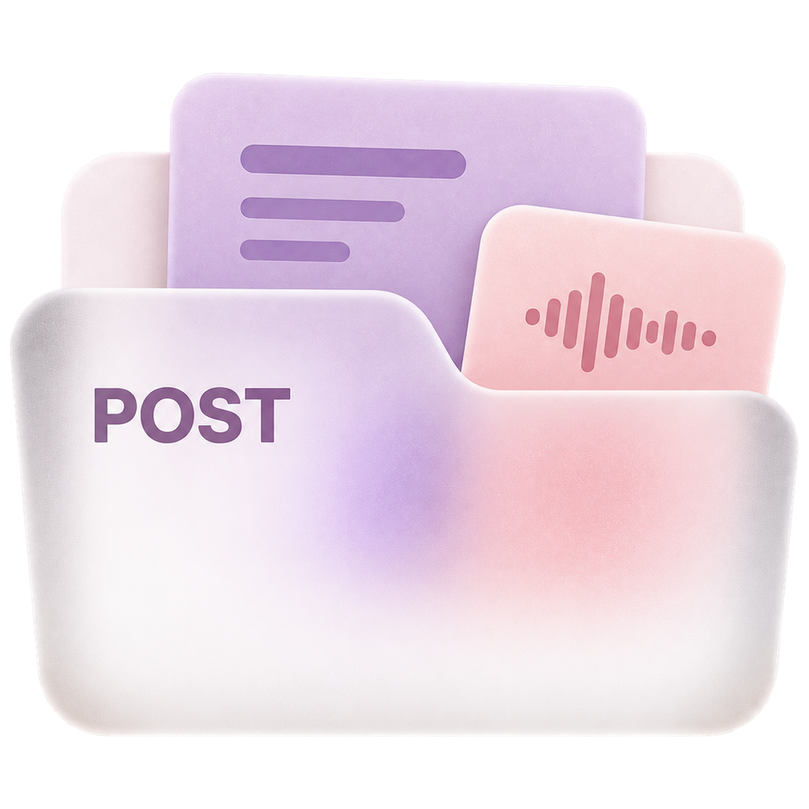
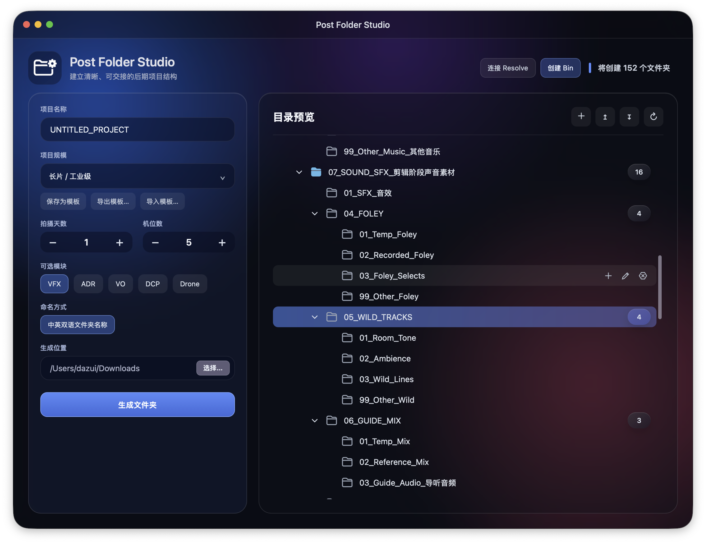

  

<h1 align="center">Post Folder Studio</h1>

为影视后期建立清晰、可交接的项目目录。 A macOS app for organizing post-production folders and bins.

  
  
  

  <a href="https://github.com/Sarahliu39/post-folder-studio/releases/latest">下载 DMG · Download</a> · 
  <a href="https://github.com/Sarahliu39/post-folder-studio/releases/latest/download/Post-Folder-Studio-Premiere.ccx">Premiere 插件 · PR Plugin</a> ·
  <a href="#features">功能 · Features</a> · 
  <a href="#installation">安装 · Installation</a> · 
  <a href="https://github.com/Sarahliu39/post-folder-studio/issues">反馈 · Feedback</a>

## 界面演示 · Interface Demo

*真实界面示例，来自早期版本截图；当前版本的文字和外观可能不同。*  
*Actual interface example from an earlier build; current labels and appearance may differ.*

## 功能 · Features

| 中文 | English |
| --- | --- |
| **项目目录模板**：适用于短片、纪录片、长片及剪辑部门等工作场景。 | **Project presets** for short films, documentaries, features and editorial departments. |
| **按项目组织**：根据拍摄天数、机位数及可选模块生成结构。 | **Project-based organization** using shooting days, camera counts and optional modules. |
| **可编辑预览**：新增、重命名、删除节点，确认后再生成文件夹。 | **Editable preview**: add, rename and remove nodes before creating folders. |
| **可复用模板**：保存个人模板，导入和导出 JSON。 | **Reusable templates**: save custom structures and import or export JSON. |
| **Bin 创建**：目前支持在已打开的 DaVinci Resolve 项目中创建媒体池 Bin。 | **Bin creation**: currently supports media-pool bins in an open DaVinci Resolve project. |
| **个性化外观**：中英文界面、日夜配色、玻璃／磨砂／纯色材质和透明度。 | **Personalized appearance**: Chinese/English UI, light/dark palettes, glass/frosted/solid materials and transparency. |
| **软件内更新**：检查、下载、验证签名、安装与重启。 | **In-app updates**: check, download, verify signatures, install and relaunch. |

## 下载与安装 · Download & Installation

1. 在 [Releases](https://github.com/Sarahliu39/post-folder-studio/releases/latest) 下载 DMG。  
   Download the DMG from [Releases](https://github.com/Sarahliu39/post-folder-studio/releases/latest).
2. 打开 DMG，将 **Post Folder Studio.app** 拖入 **Applications**。  
   Open the DMG and drag **Post Folder Studio.app** into **Applications**.
3. 从“应用程序”启动软件。  
   Launch the app from **Applications**.

**系统要求 / Requirements:** Apple Silicon（M 系列）Mac · macOS 13+。暂无 Intel 或 Windows 安装包。 / No Intel or Windows build is currently provided.

> 当前安装包尚未经过 Apple Developer ID 签名与公证，首次启动可能提示无法验证开发者。  
> This build is not Developer ID-signed or notarized by Apple. macOS may warn that the developer cannot be verified.

## 快速开始 · Quick Start

**项目名称 → 模板 → 天数与机位 → 检查预览 → 生成文件夹**  
**Project name → Preset → Days & cameras → Review preview → Create folders**

创建 Resolve Bin 前，请打开目标项目并启用本地脚本访问。可用性取决于 Resolve 版本和配置。  
Before creating Resolve bins, open the target project and enable local scripting access. Availability depends on your Resolve version and configuration.

## 更新与订阅 · Updates & Subscriptions

从 **5.0.0** 起，在 **Settings → 软件更新 / Software Update** 中下载并安装新版，也可启用自动检查和自动下载。更新由 Sparkle 提供，安装包来自本仓库 Releases，安装前验证更新签名。需要重启时请先保存工作。

Starting with **5.0.0**, use **Settings → Software Update** to download and install new versions, with optional automatic checks and downloads. Sparkle retrieves packages from this repository and verifies update signatures before installation. Save your work before relaunching.

**旧版需要手动安装本版一次，之后即可使用内置更新。**  
**Older builds without the updater require one manual installation first.**

发布通知：**Watch → Custom → Releases**；Star 不等于订阅。  
Release notifications: **Watch → Custom → Releases**; starring does not subscribe you.

## 反馈 · Feedback

请在 [Issues](https://github.com/Sarahliu39/post-folder-studio/issues) 提交版本号、macOS 版本、芯片型号、复现步骤和截图，避免包含私人项目资料。  
Report issues with the app version, macOS version, chip model, reproduction steps and screenshots. Please exclude private project information.

## 关于仓库 · About This Repository

本仓库用于分发安装包、展示软件和发布更新，不公开应用源代码。  
This repository distributes application builds, documentation and update information. Application source code is not published here.

## Premiere Pro 配套插件 · Premiere Pro Companion Plugin

**Post Folder Studio for Premiere · v1.0.6 · UXP**

将桌面版的目录规划带入 Premiere Pro。插件读取 Post Folder Studio 导出的 `.pfs-template.json`，在当前 Premiere 项目中创建对应的 Bin 层级。

Bring your folder plan into Premiere Pro. The plugin reads a `.pfs-template.json` exported from Post Folder Studio and creates the corresponding bin hierarchy in the current Premiere project.

| 中文 | English |
| --- | --- |
| 使用模板中的项目名称创建根 Bin，并补齐子层级。 | Creates a root bin using the template project name and fills in the hierarchy. |
| 只创建缺失的 Bin，不删除、移动或重命名已有 Bin 和素材。 | Creates missing bins without deleting, moving or renaming existing bins or media. |
| 再次同步同一模板时复用已有结构，避免重复创建。 | Reuses the existing structure when syncing the same template again. |
| 回读验证创建结果，显示新建、已有和已验证数量。 | Reads back the results and reports created, existing and verified counts. |

### 使用流程 · Workflow

**导出模板 → 选择模板 → 确认当前项目 → 同步 Bin**  
**Export template → Choose template → Confirm project → Sync bins**

1. 在 Post Folder Studio 中选择或编辑结构，点击“导出模板…”。  
   Select or edit a structure in Post Folder Studio and choose **Export Template**.
2. 在 Premiere 打开目标项目及 **窗口 → UXP 插件 → Post Folder Studio** 面板。  
   Open the target project and **Window → UXP Plugins → Post Folder Studio** panel.
3. 点击“选择模板…”，选择导出的 JSON 文件。  
   Click **Choose Template** and select the exported JSON file.
4. 核对当前项目名称，点击“同步到 Premiere”，查看结果。  
   Confirm the current project name, click **Sync to Premiere**, and review the result.

### 环境与分发 · Requirements & Distribution

插件清单要求 **Premiere Pro 25.6+**。随附说明的开发加载方式使用 **Adobe UXP Developer Tool 2.2+**：添加插件源文件中的 `manifest.json`，然后点击 **Load**。

The manifest requires **Premiere Pro 25.6+**. The included development-loading instructions use **Adobe UXP Developer Tool 2.2+**: add the plugin source `manifest.json`, then click **Load**.

> 此插件只同步 Bin 结构，不导入素材或编辑时间线。它是独立配套组件，不包含在桌面版 DMG 中；桌面版自动更新不负责更新此 UXP 插件。
>
> The plugin synchronizes bin structure only; it does not import media or edit timelines. It is a separate companion, not bundled in the desktop DMG. The desktop updater does not update this UXP plugin.
